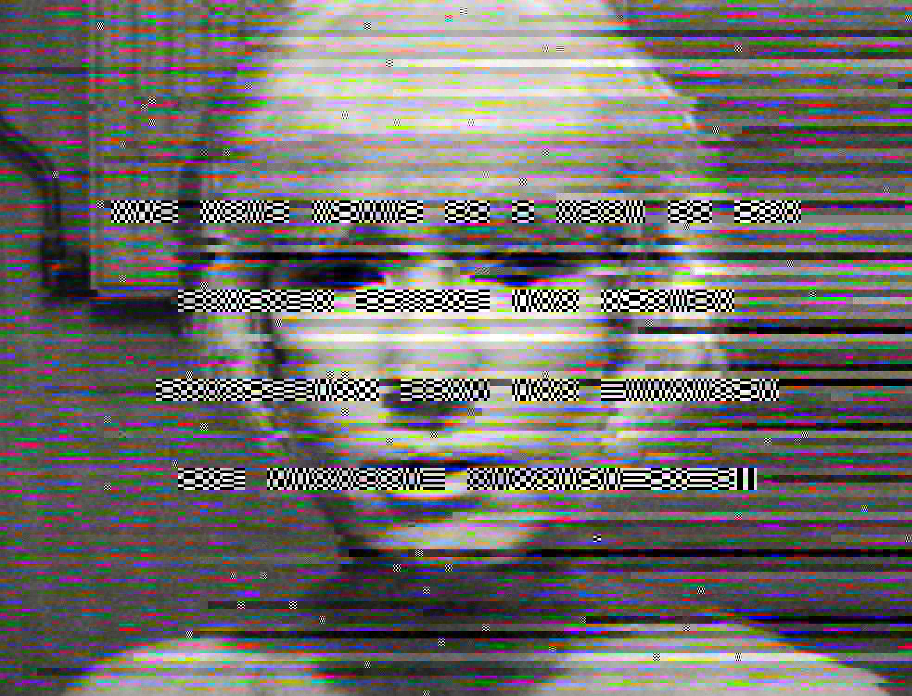

# Quiz-8
## Part 1: Imaging Technique Inspiration

### Imaging Technique: File-format Corruption / Databending

**Example:** Rosa Menkman — *A Vernacular of File Formats*  
**Source:** [A Vernacular of File Formats](https://beyondresolution.info/A-Vernacular-of-File-Formats)

Rosa Menkman’s *A Vernacular of File Formats* inspires my project through its use of file-format corruption and compression artifacts. I am interested in how the same portrait is transformed by different digital errors: pixel blocks, broken colour channels, scanning lines, and fragmented text-like patterns. I would like to incorporate this unstable, damaged-image aesthetic to make visuals feel less polished and more technological. This technique is beneficial because it turns digital failure into a visual language, creating strong texture, motion potential, and a sense of hidden systems becoming visible.